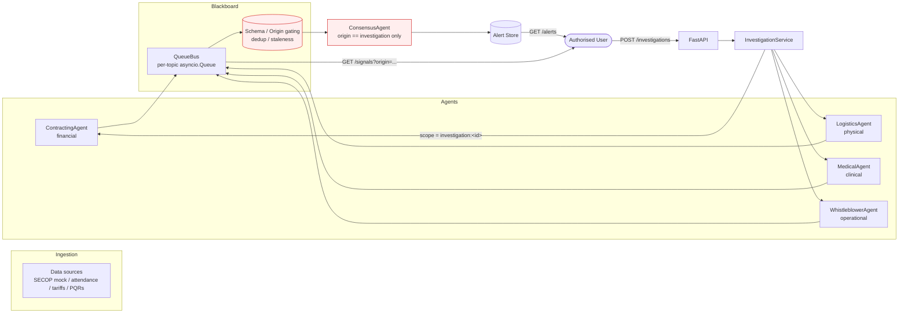
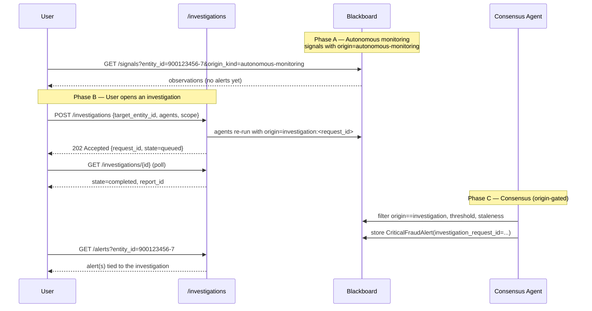

# Holmes Swarm — Healthcare Fraud Detection

Decentralized "Swarm" / Blackboard system for detecting fraud in public-health contracting (inspired by the Bogotá "Cartel de la Cardiología" case).

> **Alert governance:** A `Critical Fraud Alert` is emitted **only** when a signal originates from a user-initiated `Investigation Request`. Autonomous monitoring produces observations on the Blackboard but never fires alerts.

See `specs/001-fraud-detection-swarm/spec.md` for the feature specification and `specs/001-fraud-detection-swarm/quickstart.md` for end-to-end validation steps.

## Install

```bash
python3 -m venv .venv && source .venv/bin/activate
pip install -e ".[dev]"
```

## Configure

```bash
cp config/example.yml config/local.yml
cp config/auth.yml.example config/auth.yml   # add bearer tokens
```

## Run

```bash
# API
uvicorn holmes_swarm.api.app:app --host 127.0.0.1 --port 8000

# CLI
holmes-swarm run --config config/local.yml
holmes-swarm investigate --entity 900123456-7 --agents contracting medical
holmes-swarm alerts
holmes-swarm audit-log --since "$(date -u -d '1 hour ago' '+%Y-%m-%dT%H:%M:%SZ')"
```

## Architecture (Mermaid)



## How to run an investigation (find a finding → open a case → get an alert)

The two-mode flow is the core workflow:

1. **Autonomous monitoring** continuously writes *observations* (`signals` with `origin = "autonomous-monitoring"`) onto the Blackboard. These never produce alerts on their own.
2. **A user-initiated investigation** is the only thing that can turn a finding into a `Critical Fraud Alert`. You point the swarm at a specific entity (and optionally a subset of agents), the selected agents re-run against that entity with `origin = "investigation:<request_id>"`, and the Consensus Agent emits the alert.

### 1) Start the API

```bash
uvicorn holmes_swarm.api.app:app --host 127.0.0.1 --port 8000
```

The default app is wired from `config/example.yml` (mock LLM, offline-friendly).

### 2) Find a finding on the Blackboard (autonomous signals)

Autonomous signals are observable for any entity the swarm has ingested. Filter by entity and/or signal type:

```bash
TOKEN="demo-token-esteban"   # from config/example.yml

# All autonomous signals for an entity
curl -H "Authorization: Bearer $TOKEN" \
  "http://127.0.0.1:8000/signals?entity_id=900123456-7&origin_kind=autonomous-monitoring"

# Just the financial ones
curl -H "Authorization: Bearer $TOKEN" \
  "http://127.0.0.1:8000/signals?entity_id=900123456-7&origin_kind=autonomous-monitoring&limit=20"
```

Each signal includes `entity_id`, `signal_type`, `source_agent`, `confidence`, `evidence`, `emitted_at`, and the immutable `origin.kind`. The `entity_id` (tax ID for providers / professional license for individuals) is what you need to open the investigation.

Confirm there is **no** alert yet for the entity — autonomous signals are observation-only:

```bash
curl -H "Authorization: Bearer $TOKEN" \
  "http://127.0.0.1:8000/alerts?entity_id=900123456-7"
# expected: {"items": []}
```

### 3) Open an investigation for that entity

The body takes the entity id from the finding plus any scope you want (date range, location, suspected procedure, free-form narrative). `agents` is optional — omit it to run all enabled agents.

```bash
curl -X POST -H "Authorization: Bearer $TOKEN" -H "Content-Type: application/json" \
  -d '{
        "target_entity_id": "900123456-7",
        "agents": ["contracting", "logistics", "medical"],
        "scope": {
          "date_from": "2026-01-01",
          "date_to":   "2026-06-01",
          "location":  "Bogotá",
          "procedure": "cateterismo",
          "narrative": "Patrón de precios bajo percentil 5 + impossibilidad geográfica detectada en monitorización autónoma"
        }
      }' \
  http://127.0.0.1:8000/investigations
# → 202 Accepted
# {"request_id":"7a5b6f12-...","state":"queued","status_url":"/investigations/7a5b6f12-..."}
```

Each selected agent re-runs for that entity inside the investigation's scope and publishes signals with `origin = {"kind": "investigation", "investigation_request_id": "..."}`.

### 4) Poll status until `completed`

```bash
curl -H "Authorization: Bearer $TOKEN" \
  http://127.0.0.1:8000/investigations/7a5b6f12-9e10-4d3a-8c1b-2a0b1f3d4e5a
```

States: `queued` → `running` → `completed` (or `failed` on timeout).

### 5) Retrieve the Investigation Report

```bash
curl -H "Authorization: Bearer $TOKEN" \
  http://127.0.0.1:8000/investigations/7a5b6f12-9e10-4d3a-8c1b-2a0b1f3d4e5a/report
```

The report contains: target entity, agents that ran, signal ids produced inside the investigation's scope, and a human-readable summary.

### 6) Verify the Critical Fraud Alert

Because the investigation produced one or more above-threshold signals, the Consensus Agent emits an alert tied to that case:

```bash
curl -H "Authorization: Bearer $TOKEN" \
  "http://127.0.0.1:8000/alerts?entity_id=900123456-7"
```

Every alert carries `investigation_request_id` (FR-034) — there are no alerts without a case. To see the full payload including evidence:

```bash
curl -H "Authorization: Bearer $TOKEN" \
  http://127.0.0.1:8000/alerts/<alert_id>
```

### 7) Audit trail

Every investigation submission and completion is recorded:

```bash
holmes-swarm audit-log --since "$(date -u -d '1 hour ago' '+%Y-%m-%dT%H:%M:%SZ')"
# or via API: app.state.audit (in-process) / extend /audit route in your deployment
```

### One-shot via CLI

The CLI wraps the same endpoints:

```bash
TOKEN="demo-token-esteban"

# Submit
holmes-swarm investigate \
  --entity 900123456-7 \
  --agents contracting,medical \
  --token "$TOKEN"

# List alerts
holmes-swarm alerts --entity 900123456-7 --token "$TOKEN"
```

### Flow recap



See `examples/bed_occupancy_agent.py` and `specs/001-fraud-detection-swarm/contracts/agent-contract.md`.

## Security & permissions

Per-agent internet access is enforced via allow-list (FR-017…FR-023). Default for any newly registered agent = **no internet access**.

| Agent | Internet |
|-------|----------|
| Contracting | YES — allow-listed public contracting endpoints |
| Logistics | YES — allow-listed routing service |
| Medical | **NO** (air-gapped; local RAG only) |
| Whistleblower | Optional — LLM endpoint only, when remote LLM configured |
| Consensus | **NO** |

Outbound HTTP calls are logged with redaction of PQR text and PHI (FR-021). All investigation requests are audit-logged (FR-030). Investigation API requires bearer token (FR-029).
