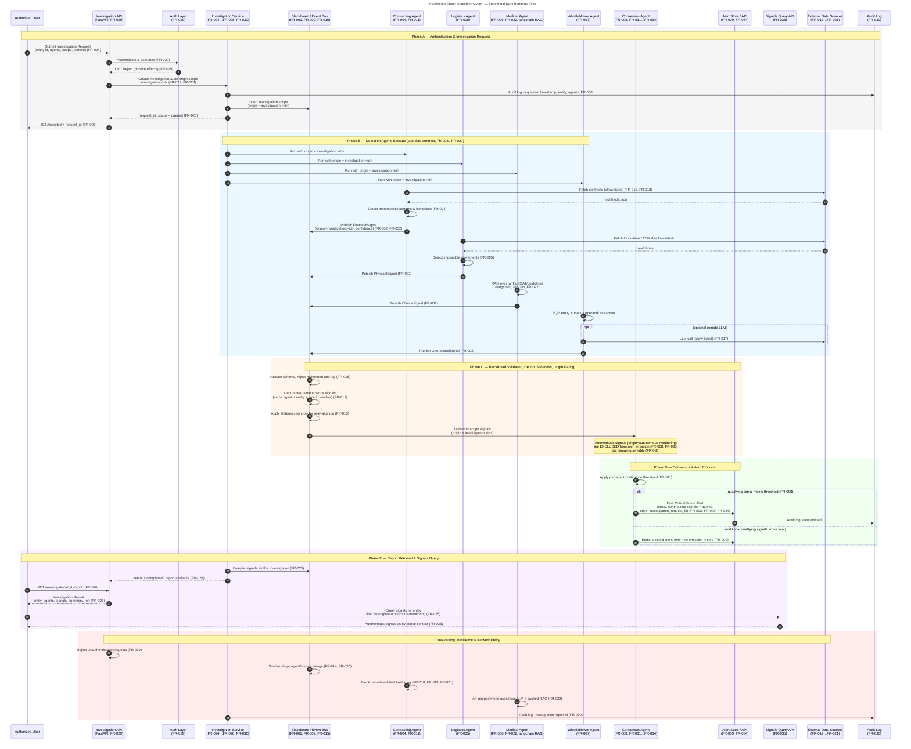

```mermaid
sequenceDiagram
    autonumber
    title Healthcare Fraud Detection Swarm — Functional Requirements Flow

    participant U as Authorized User
    participant API as Investigation API<br/>(FastAPI, FR-029)
    participant Auth as Auth Layer<br/>(FR-029)
    participant IS as Investigation Service<br/>(FR-024…FR-028, FR-030)
    participant BB as Blackboard / Event Bus<br/>(FR-001, FR-002, FR-015)
    participant CA as Contracting Agent<br/>(FR-004, FR-011)
    participant LA as Logistics Agent<br/>(FR-005)
    participant MA as Medical Agent<br/>(FR-006, FR-022, langchain RAG)
    participant WA as Whistleblower Agent<br/>(FR-007)
    participant CO as Consensus Agent<br/>(FR-008, FR-031…FR-034)
    participant AL as Alert Store / API<br/>(FR-009, FR-034)
    participant Q as Signals Query API<br/>(FR-035)
    participant DS as External Data Sources<br/>(FR-017…FR-021)
    participant AU as Audit Log<br/>(FR-030)

    rect rgb(245,245,245)
    Note over U,AU: Phase A — Authentication & Investigation Request
    U->>API: Submit Investigation Request<br/>(entity id, agents, scope, context) (FR-024)
    API->>Auth: Authenticate & authorize (FR-029)
    Auth-->>API: OK / Reject (no side effects) (FR-029)
    API->>IS: Create investigation & set origin scope<br/>investigation:<id> (FR-027, FR-028)
    IS->>AU: Audit log: requester, timestamp, entity, agents (FR-030)
    IS->>BB: Open investigation scope<br/>(origin = investigation:<id>)
    IS-->>API: request_id, status = queued (FR-026)
    API-->>U: 202 Accepted + request_id (FR-026)
    end

    rect rgb(235,248,255)
    Note over IS,WA: Phase B — Detection Agents Execute (standard contract, FR-003 / FR-027)
    IS->>CA: Run with origin = investigation:<id>
    IS->>LA: Run with origin = investigation:<id>
    IS->>MA: Run with origin = investigation:<id>
    IS->>WA: Run with origin = investigation:<id>

    CA->>DS: Fetch contracts (allow-listed) (FR-017, FR-018)
    DS-->>CA: contracts.json
    CA->>CA: Detect monopolistic patterns & low prices (FR-004)
    CA->>BB: Publish FinancialSignal<br/>(origin=investigation:<id>, confidence) (FR-002, FR-032)

    LA->>DS: Fetch travel-time / OSRM (allow-listed)
    DS-->>LA: travel times
    LA->>LA: Detect impossible movements (FR-005)
    LA->>BB: Publish PhysicalSignal (FR-002)

    MA->>MA: RAG over tariffs/SOAT/guidelines<br/>(langchain, FR-006, FR-022)
    MA->>BB: Publish ClinicalSignal (FR-002)

    WA->>WA: PQR entity & modus operandi extraction
    opt optional remote LLM
        WA->>DS: LLM call (allow-listed) (FR-017)
    end
    WA->>BB: Publish OperationalSignal (FR-002)
    end

    rect rgb(255,245,235)
    Note over BB,AL: Phase C — Blackboard Validation, Dedup, Staleness, Origin Gating
    BB->>BB: Validate schema, reject malformed and log (FR-015)
    BB->>BB: Dedup near-simultaneous signals<br/>(same agent + entity + type in window) (FR-012)
    BB->>BB: Apply staleness window for re-evaluation (FR-013)
    BB->>CO: Deliver in-scope signals<br/>(origin = investigation:<id>)
    Note over CO: Autonomous signals (origin=autonomous-monitoring)<br/>are EXCLUDED from alert emission (FR-008, FR-033)<br/>but remain queryable (FR-035)
    end

    rect rgb(240,255,240)
    Note over CO,AL: Phase D — Consensus & Alert Emission
    CO->>CO: Apply per-agent confidence threshold (FR-011)
    alt qualifying signal meets threshold (FR-008)
        CO->>AL: Emit Critical Fraud Alert<br/>(entity, contributing signals + agents,<br/>origin investigation_request_id) (FR-008, FR-009, FR-034)
        AL->>AU: Audit log: alert emitted
    else additional qualifying signals arrive later
        CO->>AL: Enrich existing alert, emit new emission record (FR-009)
    end
    end

    rect rgb(248,240,255)
    Note over U,Q: Phase E — Report Retrieval & Signals Query
    IS->>BB: Compile signals for this investigation (FR-025)
    IS-->>API: status = completed / report available (FR-026)
    U->>API: GET /investigations/{id}/report (FR-026)
    API-->>U: Investigation Report<br/>(entity, agents, signals, summary, ref) (FR-025)

    U->>Q: Query signals for entity<br/>filter by origin=autonomous-monitoring (FR-035)
    Q-->>U: Autonomous signals as evidence context (FR-035)
    end

    rect rgb(255,235,235)
    Note over API,DS: Cross-cutting: Resilience & Network Policy
    API->>API: Reject unauthenticated requests (FR-029)
    BB->>BB: Survive single agent/source outage (FR-014, FR-020)
    CA->>CA: Block non-allow-listed host + log (FR-018, FR-019, FR-021)
    MA->>MA: Air-gapped mode uses local LLM + cached RAG (FR-022)
    IS->>AU: Audit log: investigation report id (FR-030)
    end
```